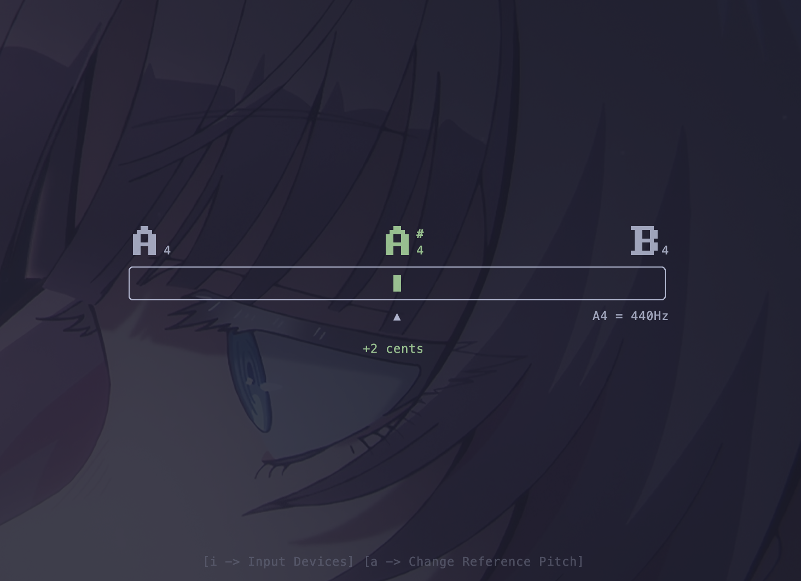

# clatune

A terminal based tuner application written in Rust using [ratatui](https://github.com/ratatui-org/ratatui)



## Installation

### System Dependencies

Since `clatune` processes live audio via `cpal` (with PipeWire and PulseAudio backends), you need the following system libraries installed:

**Linux (Ubuntu/Debian/Pop!_OS):**
```bash
sudo apt install libasound2-dev libpipewire-0.3-dev pkg-config clang
```

**Arch Linux:**
```bash
sudo pacman -S alsa-lib pipewire pkg-config clang
```

**Fedora:**
```bash
sudo dnf install alsa-lib-devel pipewire-devel pkg-config clang
```

**macOS:**
No additional libraries are required.

**Windows:**
No additional libraries are required.


### Install `clatune` with `cargo`
```bash
cargo install --git https://github.com/cladamos/clatune
```


## Usage

Simply run the command to tune your instrument:

```bash
clatune
```

### Controls

- `q` or `ctrl+c`: Quit the application
- `i`: Open input devices
- `a`: Change reference pitch

